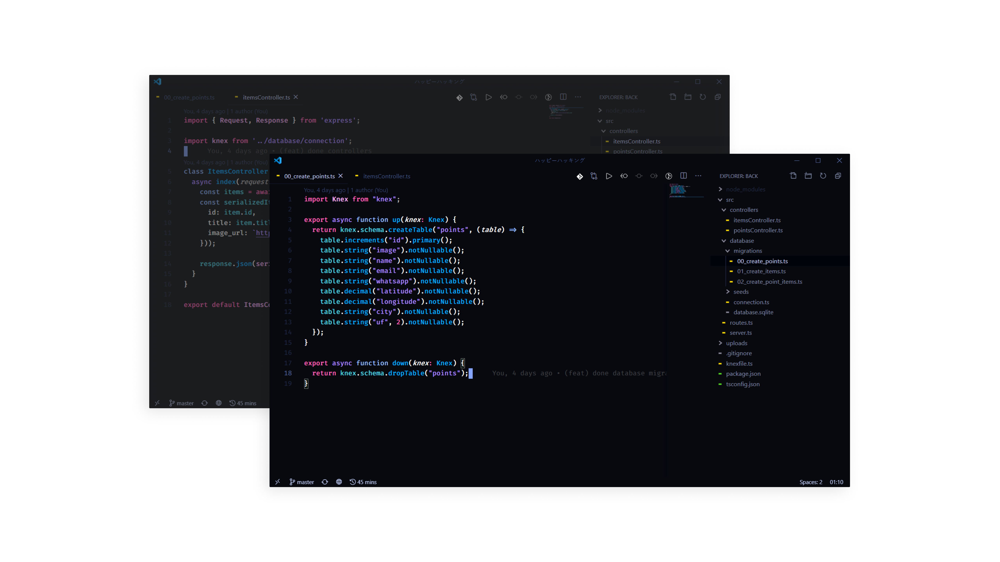

### :deciduous_tree: bonsai (deprecated)

bonsai is a minimalist VSCode theme 

  <!-- Version -->
  
  <!-- Downloads -->
  
  <!-- Rating -->
  

### warning
this theme is not supported anymore, but you can still use it.

### installation

- open the extensions sidebar in VSCode
- search for Bonsai
- click on install
- open the command palette with `Ctrl + Shift + P` or `⇧ ⌘ P`
- select `Preferences: Color Theme` and choose the Bonsai color scheme
- enjoy!
